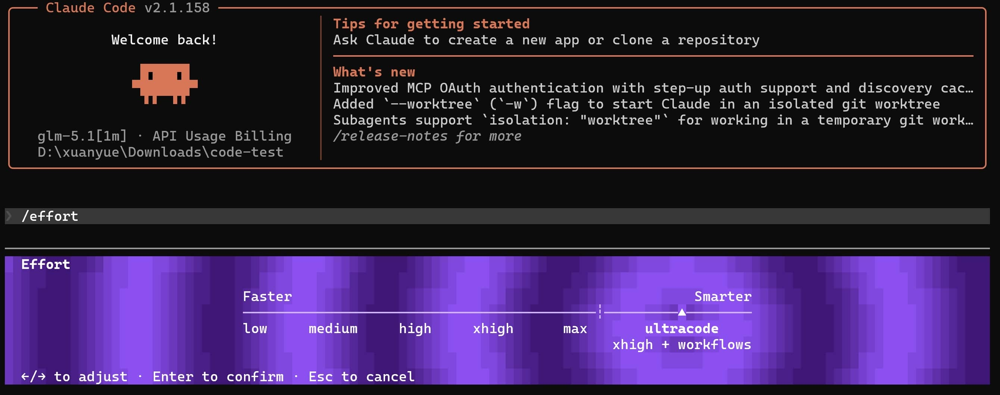
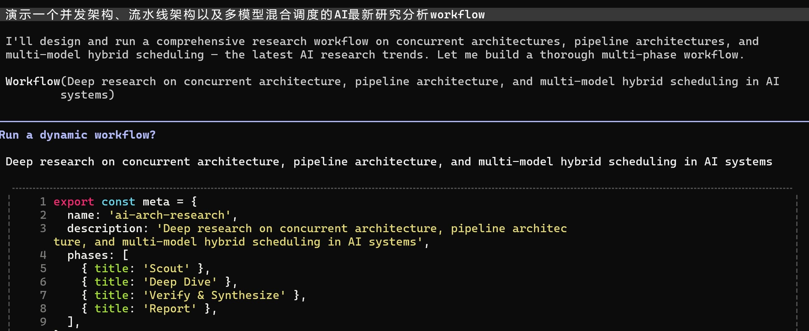

在 LLM 驱动的自动化工具链中，传统的单窗口或多 Agent 交互模式往往受限于上下文窗口膨胀和状态管理混乱。近日，Claude Code 推出了一项关键更新——Workflows。该机制通过将状态管理与逻辑控制从大模型上下文移至本地脚本，为解决复杂、大规模的 Agent 编排任务提供了一种更具确定性的方案 。
## 传统多Agent编排难以规模化

在传统的 Claude 交互或早期的 Sub-agent（子智能体）模式中，用户通常通过一个主会话窗口进行操作 。当需要执行复杂任务时，主窗口作为核心编排器，负责调度不同的子 Agent、运行工具或调用模型能力 。
这种设计在面对大规模或长流程任务时，暴露出以下几项核心缺陷：

随着对话的持续、工具的频繁调用（如 MCP、Shell 脚本执行）以及长推理过程的加入，主窗口的上下文会迅速被垃圾信息填满 。即使模型拥有高达 1M 的上下文容量，这种饱含中间过程的“冗余上下文”依然会导致模型注意力分散、响应速度变慢，并引发高额的 Token 消耗 。


当主会话窗口需要同时或先后管理多个子 Agent 时，它必须在自身的上下文中持有所有中间状态 。模型既要追踪哪个子 Agent 正在运行，又要管理它们返回的数据，同时还要决定下一步的执行逻辑 。这种高负载的非确定性管理，极易导致主编排器在规模化场景下丢失上下文或产生逻辑混乱 。

## 改用确定性的静态脚本

Workflows 的核心改进在于**解耦“编排控制层”与“模型上下文层”**，将原本由 LLM 承担的管理职责移交给本地的JS脚本（如 `workflow.js`）。

在 Workflows 架构下，主会话窗口不再直接感知复杂的中间执行过程 。当工作流启动时，系统会为具体任务派生出独立的 Sub-agent 。每个 Sub-agent 拥有完全隔离且干净的上下文窗口 。它们在各自的独立环境里执行数万 Token 级别的工具调用和推理，最终只将压缩后的核心结果投喂回主会话，从而避免了主窗口的上下文膨胀 。

通过引入 `workflow.js` 脚本，工作流的状态不再依赖不稳定的 LLM 记忆，而是记录在确定性的编程语言变量中 。流程控制（如条件分支、Fan-out 并行、Pipeline 串行、重试循环）全部交由代码层面的逻辑来硬性约束 。

在运行时，Workflow 以独立进程的方式启动，并在脚本与 Sub-agent 之间维护一个名为 **Journal（日志状态流）** 的中间层 。该机制能够实时记录当前工作流的执行进度与每一步的状态变更 。这意味着，当工作流由于网络、预算触发或人工干预中断时，用户可以安全地暂停并稍后恢复任务，而无需从头重新跑一遍流程、重复消耗 Token 。

## 技术实现与落地细节

### 如何调用

终端输入框输入指令 effort ，选择ultracode模式



### 脚本分析

可以通过自然语言命令（需要在对话中包含 workflow关键字）让 Claude 自动生成对应的控制脚本，或者直接手动编写与修改该配置文件 。

一个典型的多阶段、多模型混合调度的自动化工作流配置结构示意：

```javascript
// workflow.js示例结构
export default {
  name: "brand_identity_forge",
  [cite_start]description: "演示 Fan-out 并行、Pipeline 串行及多模型混合调度的品牌设计工作流", [cite: 91]
  
  // 显式划分不同的阶段 (Phases)
  phases: [
    {
      name: "generate",
      [cite_start]description: "并行头脑风暴生成候选方案", [cite: 103]
      [cite_start]model: "claude-3-haiku", // 阶段一：使用低成本、高速度的模型 [cite: 120]
      [cite_start]count: 6, // 启动 6 个并发 Agent [cite: 103]
      [cite_start]prompt: "根据输入主题，快速头脑风暴 3 个富有创意的品牌名称与口号。" [cite: 103]
    },
    {
      name: "critique",
      [cite_start]description: "对候选方案进行多维度打分审查", [cite: 104]
      [cite_start]model: "claude-3-5-sonnet", // 阶段二：使用推理能力较强的标准模型 [cite: 121]
      [cite_start]prompt: "分析上一阶段生成的候选方案，从市场可行性、新颖度等维度进行严格打分，选出最优解。" [cite: 71, 104]
    },
    {
      name: "synthesize",
      [cite_start]description: "最终方案终审与文档输出", [cite: 104]
      [cite_start]model: "claude-3-opus", // 阶段三：使用高理解力的旗舰模型进行统筹 [cite: 121]
      [cite_start]prompt: "针对胜出的方案，完善并输出最终的品牌白皮书与商业规划陈述。" [cite: 104, 105]
    }
  ]
};

```

通过这种配置，开发者可以在流程初期全量指派给低成本的Haiku 模型，在核心逻辑审计或代码实现部分调用 Sonnet，最后由 Opus 进行全盘校对与文本终审 。这种混合架构在保证全流程质量的同时，能有效控制开销 。

## 大规模编排模式：Deep Research 深度研究工作流

Workflows 最具代表性的开箱即用落地场景是 Claude 内置的 **Deep Research（深度研究）能力** 。该功能通过五阶段的复杂 Agent 网络，展现了大规模编排的典型设计模式 ：

| **阶段 (Phase)**           | **执行逻辑与 Agent 规模 TXT**                                                                            |
| ------------------------ | ------------------------------------------------------------------------------------------------- |
| **1. Scope (定义边界)**      | 拆解核心诉求。例如将单技术/业务课题拆解为 5 个不同的纵向搜索视角（Angles），由 1 个基准 Agent 运行 。                                     |
| **2. Fetch (并发检索)**      | 启动 5 个并行的 Web 搜索任务（对应 5 个视角），进行全网数据去重（De-duplicate），并提取前 15 个高质量源的确定性断言或结论 。                      |
| **3. Verify (对抗性验证)**    | **消耗资源最大的核心核心阶段。** 对提取出的每一个核心断言，引入对抗性机制：为每个声明指派 3 个独立的对立验证 Agent 进行联合交叉质询，必须满足“2/3 多数票”通过才能确认为真 。 |
| **4. Synthesize (合流综合)** | 清洗、去伪存真后，整合所有被证实的论点，开始进行全局的信息合流与文本输出 。                                                            |

在实际跑一个关于“特定生物学/医学参数研究”的 Deep Research 任务时，由于 Verify 阶段的对抗性设计，Agent 数量会随着断言数量呈线性几何倍数爆发 。例如在 15 分钟内，系统可能会动态派生出超过 **105 个 Agent** 进行并发交互，吞吐的 Token 总数可轻易冲破 **300 万次（3.1M Tokens）** 。

## 总结

Workflows 的出现并非为了替代日常的简单对话或轻量级的 Skills 机制 。在商业和开发场景中：
* 如果任务是日常、线性的重复动作（如简单的 PR 审查、标准格式转换），**优先使用常规 Skills 机制**，以确保最低的 Token 开销 。

* 只有在“任务量极大需要分身并发、准确度要求极高需要对抗辩论、耗时极长需要存档续传”的复杂场景下，才值得用 Workflows 静态脚本编排的工作流 