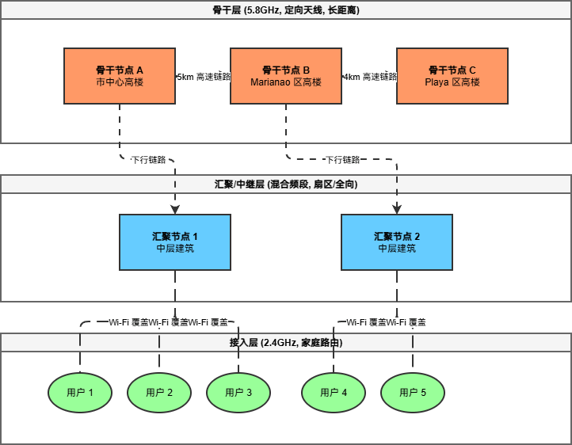
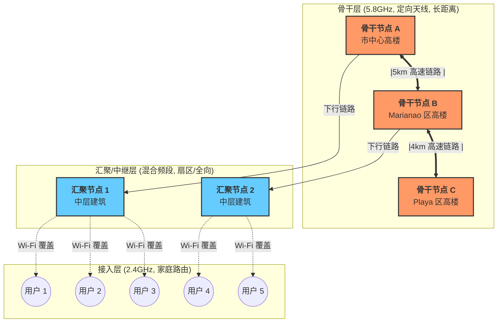
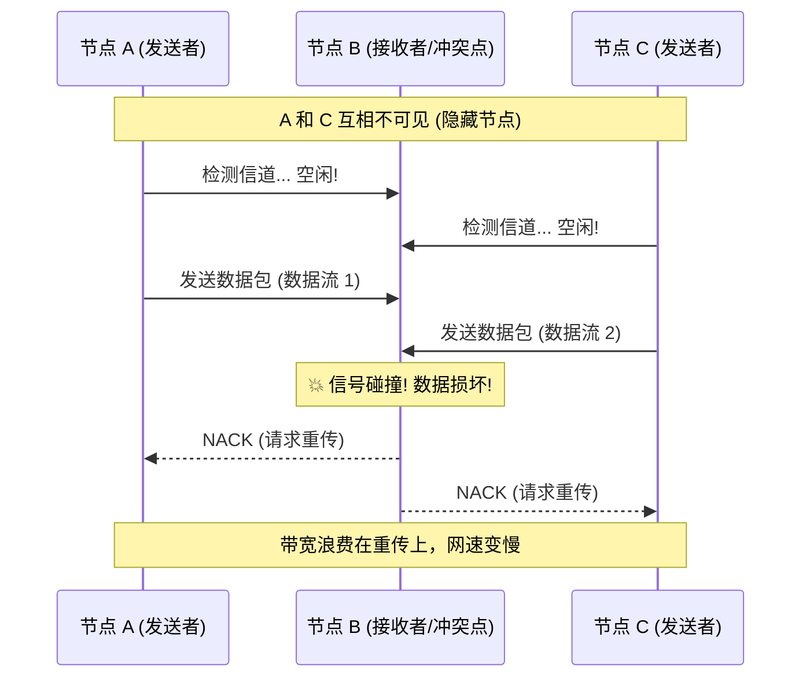

在互联网被视为像水和电一样理所当然的今天，古巴哈瓦那的居民却用双手在城市的上空编织了一张看不见的网。这就是 **SNET (Street Network)** —— 一个完全由民间自发建立、不依赖国家电信基础设施、甚至一度处于法律灰色地带的**城域无线网状网络 (City-scale Wireless Mesh Network)**。

它不仅仅是一个技术项目，更是一场关于连接、生存与社区自治的社会实验。本文将深入 SNET 的肌理，从物理架构到协议逻辑，全方位解析这个“离线互联网”是如何运作的。

## 一、背景：为什么需要 SNET？

要理解 SNET，必须先理解古巴的网络环境。
*   **高昂的资费**：在 SNET 兴起之初（约 2011 年），古巴的国际互联网接入极其昂贵，普通人的月收入可能只够买几个小时的流量。
*   **内容的匮乏**：国际带宽极窄，导致访问国外网站几乎不可能。
*   **“每周数据包”的局限**：当时流行的 *El Paquete Semanal* 通过硬盘拷贝分发电影和软件，但这是一种**单向、延迟高**的分发方式，无法实现人与人之间的实时互动（如聊天、联机游戏）。

于是，极客们想到了一个办法：**既然连不上世界，那就先连接彼此。** 他们利用廉价的民用 Wi-Fi 设备，将一个个孤立的家庭连接成一个巨大的局域网。

## 二、深度解析：分层网状拓扑结构

SNET 并非杂乱无章的乱连，经过十余年的演化，它形成了一套严谨的**三层分层架构**。这种设计是为了解决无线信号传输距离有限和城市建筑遮挡的问题。

### 1. 骨干层 (The Backbone)：城市的天际线高速公路
这是 SNET 的大动脉，负责跨街区、跨城区的长距离数据传输。
*   **节点位置**：通常位于城市最高的建筑楼顶、水塔或专门搭建的高杆上。
*   **硬件配置**：使用企业级无线网桥（如 Ubiquiti Rocket, Mimosa）配合**高增益定向天线**（如 24dBi 以上的栅格天线或抛物面天线）。
*   **频段策略**：主要使用 **5.8 GHz** 频段。
    *   *原因*：5.8GHz 频段干扰少，可用信道多（相比 2.4GHz 只有 3 个非重叠信道，5.8GHz 有十几个），且支持更高的调制率，能提供更大的带宽。
*   **连接方式**：**点对点 (PtP)** 或 **点对多点 (PtMP)**。两个骨干节点之间必须保持严格的**视距 (Line of Sight, LOS)**，中间不能有任何建筑物或树木遮挡。
*   **作用**：将哈瓦那的不同区域（如 Centro Habana, Marianao, Playa）连接成一个整体。

### 2. 汇聚/中继层 (Distribution Layer)：社区的枢纽
这一层起到承上启下的作用，将骨干网的信号“下沉”到具体的街道和小区。
*   **节点位置**：中等高度的楼房阳台或屋顶。
*   **硬件配置**：中端无线路由器，外接扇区天线（覆盖 90°-120°范围）或中等增益的全向天线。
*   **功能**：一个汇聚节点可能同时向上连接骨干节点，向下连接数十个家庭用户。它负责数据的聚合与分发。

### 3. 接入层 (Access Layer)：最后一百米
这是普通用户接触到的部分。
*   **节点位置**：居民家中。
*   **硬件配置**：普通的家用无线路由器（如 TP-Link WR740N 等经典型号），往往刷入了 **OpenWrt** 或 **DD-WRT** 等第三方固件以解锁高级功能。
*   **连接**：通过全向天线接收来自汇聚层的信号，并通过网线或 Wi-Fi 连接用户的电脑、游戏机。

## 三、核心技术深潜：为什么这么设计？

### 1. 寻址之谜：为何坚持手动静态 IP？

在现代网络中，DHCP（动态主机配置协议）是标配，但在 SNET 中，**静态 IP (Static IP)** 是铁律。这背后有深刻的技术考量：

*   **路由协议的依赖性**：SNET 广泛使用 **OLSR (Optimized Link State Routing)** 协议。OLSR 是一种“先应式”路由协议，每个节点都维护一张全网拓扑图。如果大量节点的 IP 频繁变动（DHCP 租约到期重获新 IP），会导致全网路由表剧烈震荡（Flapping），消耗宝贵的无线带宽用于广播更新，甚至导致网络瘫痪。
*   **去中心化的困境**：部署可靠的分布式 DHCP 服务器集群在低带宽、高延迟的无线网状网中极其困难。一旦主服务器宕机，大片区域将无法入网。
*   **可管理性与故障排查**：
    *   **规划**：社区管理员会按照地理区域划分 IP 段。例如，`10.20.5.x` 代表某条街道，`10.20.6.x` 代表隔壁街道。
    *   **定位**：当网络出现环路或攻击时，管理员看到日志中的源 IP `10.20.5.12`，立刻就能知道是“那条街的第 12 号节点”出了问题，直接上门解决。如果是动态 IP，这几乎是不可能的任务。

### 2. 频谱战争：信号干扰与“隐藏节点”

SNET 面临的最大物理挑战是**无线电干扰**。

#### 问题根源：2.4GHz 的拥堵
绝大多数家庭路由器工作在 **2.4 GHz ISM 频段**。这个频段非常拥挤：
*   **信道稀缺**：在 2.4GHz 频段，真正互不干扰的信道只有 **3 个**（信道 1, 6, 11）。
*   **高密度冲突**：在哈瓦那密集的居住区，视野范围内可能有几十个 Wi-Fi 信号。如果大家都自动选择信道，必然大量重叠，导致信噪比（SNR）极低，丢包率飙升。

#### 物理难题：隐藏节点 (Hidden Node Problem)
这是无线网络特有的噩梦。
*   **场景**：节点 A 和节点 C 都想发送数据给中间的节点 B。
*   **问题**：由于距离或障碍物，A 听不到 C 的信号，C 也听不到 A 的信号。
*   **后果**：A 觉得信道空闲，开始发送；C 也觉得空闲，也开始发送。两股信号在 B 处发生碰撞，数据全部损坏。B 会要求重传，导致有效吞吐量急剧下降。

#### 解决方案：人工频谱规划
SNET 没有昂贵的自动化射频管理系统，他们靠的是**人**。
*   **区域协调员**：每个片区都有技术志愿者。他们会带着笔记本电脑和频谱分析软件（如 inSSIDer, Wireshark）爬上屋顶。
*   **手动调优**：
    *   强制规定相邻节点使用不同的非重叠信道（1, 6, 11 轮换）。
    *   调整发射功率（Tx Power）：功率不是越大越好，过大的功率会增加噪声底，干扰远处节点。协调员会精确计算每个节点所需的最佳功率。
    *   **骨干升级**：强制骨干链路迁移至 **5.8 GHz** 频段，利用其丰富的信道资源避开 2.4 GHz 的“战场”。

### 3. 路由协议：让数据包找到路

SNET 的灵魂在于其路由协议，最常用的是 **OLSR (Optimized Link State Routing)**。

*   **工作原理**：
    1.  **Hello 消息**：每个节点定期广播“Hello”包，告诉邻居“我还活着”。
    2.  **MPR 选举 (Multi-Point Relays)**：为了减少广播风暴，节点会选举出一部分“关键中继节点”。只有这些 MPR 节点负责转发拓扑控制 (TC) 消息。
    3.  **拓扑构建**：通过收集 TC 消息，每个节点都能绘制出整个网络的地图。
    4.  **路径计算**：使用 Dijkstra 算法计算到达任意目标 IP 的最短路径（基于链路质量度量，而不仅仅是跳数）。
*   **优势**：即使某个节点突然断电，OLSR 能在秒级时间内重新计算路径，绕过故障点，保证网络不中断。

## 四、生态与应用：离线互联网的繁荣

在这个没有外网的局域网里，古巴人构建了完整的数字生态：

1.  **本地 Web 服务**：成千上万个运行在个人电脑上的 Apache/Nginx 服务器。内容包括：
    *   **新闻与博客**：转载国际新闻（通过离线方式导入）、本地社区公告。
    *   **视频索引站**：类似 IMDb 的本地数据库，链接到局域网内的 FTP 电影资源。
    *   **论坛与聊天室**：基于 PHP/MySQL 的本地论坛，是居民交流的主要场所。
2.  **文件共享**：
    *   巨大的 FTP 服务器集群存储着数 PB 的电影、剧集、软件和电子书。
    *   内容更新流程：最新的美剧通过“每周数据包”硬盘拷贝进入种子节点 -> 上传至核心服务器 -> 全网高速下载（局域网速度可达 10-50 Mbps，远超当时的国际宽带）。
3.  **在线游戏**：
    *   CS 1.6, Warcraft III, FIFA, Counter-Strike: Source 等游戏的局域网服务器遍布全网。这是 SNET 早期爆发的主要驱动力。
4.  **即时通讯**：
    *   开发了专门的局域网聊天客户端（如 *SNET Messenger*），支持文字、文件传输，甚至语音，完全不需要互联网。

## 五、治理与挑战：不仅仅是代码

SNET 的成功离不开其独特的**社会架构**。

*   **去中心化自治**：没有中央控制室。网络由数百个独立的节点所有者维护。
*   **“宪法”与规范**：社区自发制定了行为准则：
    *   禁止商业盈利（允许分摊电费，但禁止大规模售卖带宽）。
    *   严禁非法内容（儿童色情、恶意软件）。
    *   骨干节点承诺高在线率（99%）。
*   **与政府的博弈**：
    *   2019 年，古巴政府出台法令，试图将此类民间网络收归国有或取缔，要求所有基础设施必须经过国家电信公司 (ETECSA) 批准。
    *   这导致大量骨干节点被拆除，SNET 被迫转型、隐蔽化，或部分整合进官方的“国家局域网”项目。但其精神内核——**社区互助与技术赋权**——依然存活。

## 六、结语

古巴 SNET 是人类技术史上一个独特的案例。它证明了：**连接的本质不在于光纤或卫星，而在于人与人之间的协作意愿。**

在资源极度匮乏、外部环境封闭的条件下，古巴人民利用最廉价的硬件、开源的软件和卓越的社区组织能力，硬生生在城市上空搭建起了一座数字巴别塔。虽然它的形态可能随着政策而变化，但 SNET 所展现的极客精神和韧性，将永远激励着那些相信“网络属于每个人”的人们。

对于网络工程师而言，SNET 是一本活生生的教科书，讲述了如何在不完美的物理世界中，通过协议优化和人工智慧，构建出鲁棒的通信系统。